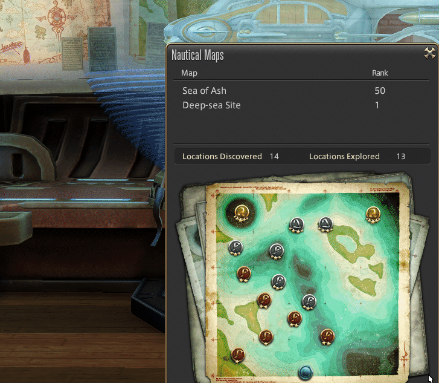
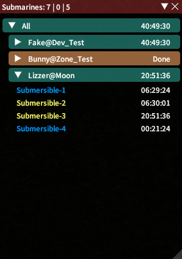

# Submarine Tracker

Simple and Easy  
+ Tracker for current builds, routes and times 
+ Builder to improve, solve builds and optimize EXP
+ Configurable notification for return and repairs 
+ Helpy filled useful information
+ Custom loot overview with history and export
+ Multiple overlays to help with daily tasks 
+ Supports multiple FCs  

### Tracker (/stracker)

### Chat Notification

### Next / Route Overlay

### Overlay (/soverlay)

### Builder (/sbuilder)

### Builder > Leveling

### Helpy (/shelpy)

### Helpy > Storage

### Loot (/sloot)

### Loot > Voyage

