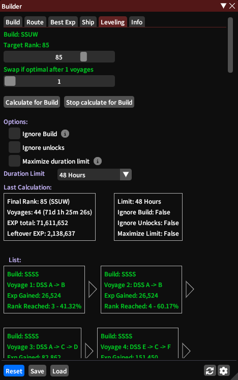
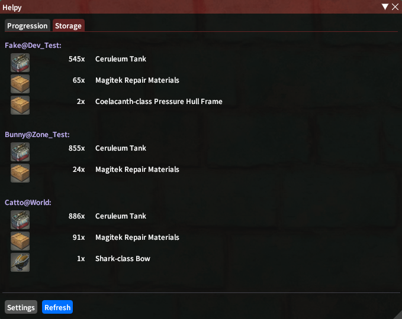
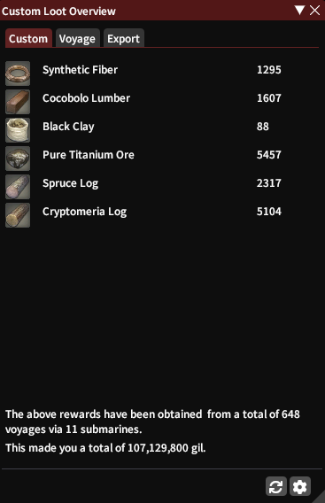
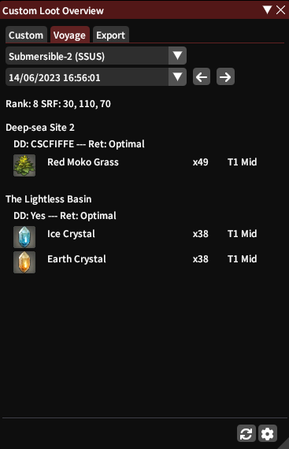

# Submarine Tracker

Simple and Easy  
+ Tracker for current builds, routes and times 
+ Builder to improve, solve builds and optimize EXP
+ Configurable Notification for return/repair 
+ Helper with useful information
+ Custom loot overview with history and export
+ Supports multiple FCs  

### Tracker (/stracker)

### Notifications > Return

### Builder (/sbuilder)

### Builder > Leveling

### Helpy (/shelpy)

### Helpy > Storage

### Loot (/sloot)

### Loot > Voyage

