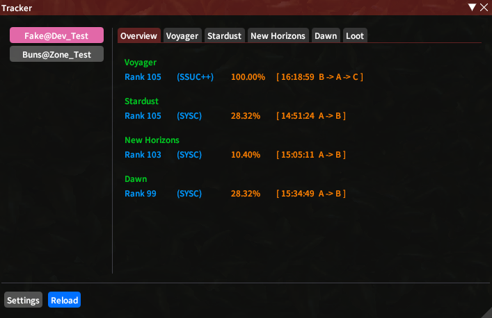
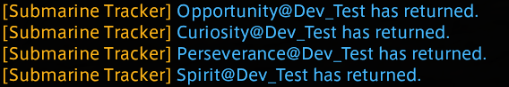
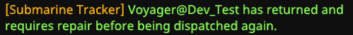
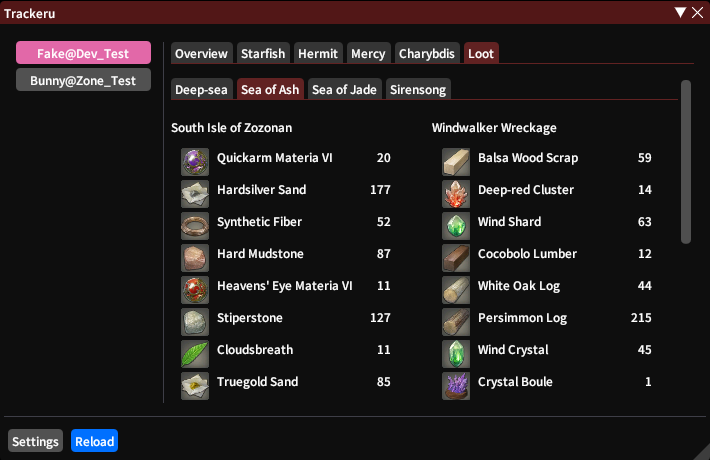
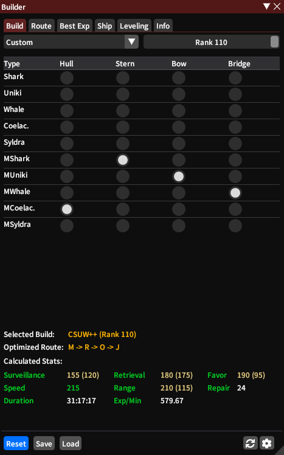
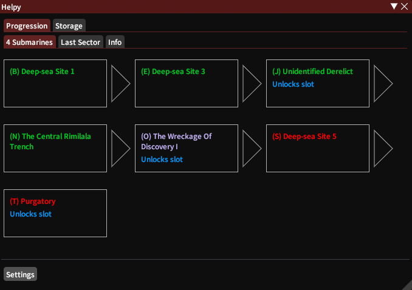

# Submarine Tracker

Simple and Easy  
+ Tracks current builds, route and time 
+ Loot overview for each FC
+ Builder to improve your builds 
+ Save and load builds
+ Optimized EXP calculator for the selected build
+ Unlockable exploration points are highlighted
+ Breakpoint support
+ Configurable notification for returning subs
+ Helper with lots of useful information
+ Support for multiple FCs  

### Tracker

### Notifications
#### Return

#### Repair

### FC Loot Overview

### Builder

### Helpy

### Planned
+ Automatic build solver
